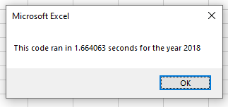
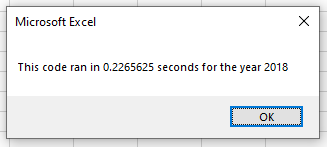

# Limited Stock Market Analysis
Performing analysis on stock market sample data.

## Overview of Project

### Purpose
- To analyze how successful certain stocks are, specifically their yearly returns, so that potential investors can be potential investors can be advised appropriately. 
- To create and refactor code so that this analysis is better scalable to larger numbers of stocks and potential investors. 

## Results and Analysis

### Stock Performance
As shown in the All Stocks Analysis sheet, stock return percentage in 2017 was much higher overall than in 2018. RUN was the only stock that had a significant increase in 2018 over 2017 while most other stocks went from positive returns to negative returns. It could have been advisable to buy stocks that dipped hard like DQ or FSLR low in anticipation of them eventually recovering to 2017 level peaks in 2019 or later. However, lack of more recent or historic data make it difficult to make any useful, conclusive points.

### Code Performance
The following images are of the run time of VBA code on the 2018 data set, first pre-refactorization, and then post-refactorization. 

While the VBA code performed satisfactorily both pre and post refactorization, refactoring the code significantly decreased the time the code took to run. Most impactfully, the refactored code only needed to scan the data set once, while the original code scanned it once per ticker. As future data sets expand to include more data from more companies, refactoring code in this way will have significant advantages. 

## Summary
In conclusion, the previously stated advantages of the refactored code, faster run times and better scalability, come at the cost of additional development time, and more advanced planning of the code, including additional variables, loops, and higher requisite understanding and difficulty of coding. This should be a worthwhile trade off, especially for code that is expected to be ran often enough that the time saved exceeds the additional time spent refactoring. 
Specifically in the VBA code of this challenge, the only advantage the pre-refactored code might have had was a possible 'fun factor' where it was satisfying to watch the excel sheet to rapidly populate with the processed data due to its slower processing speed. Besides that, the refactored data was faster to run, would be comparatively much faster with more tickers and data points in future data sets, and did not take that much longer to code with the original as a base. Things like legibility and ease of writing seem to be a wash. Both seem simple enough to follow, especially with their given comments, and both were written by following clear instructions. 
